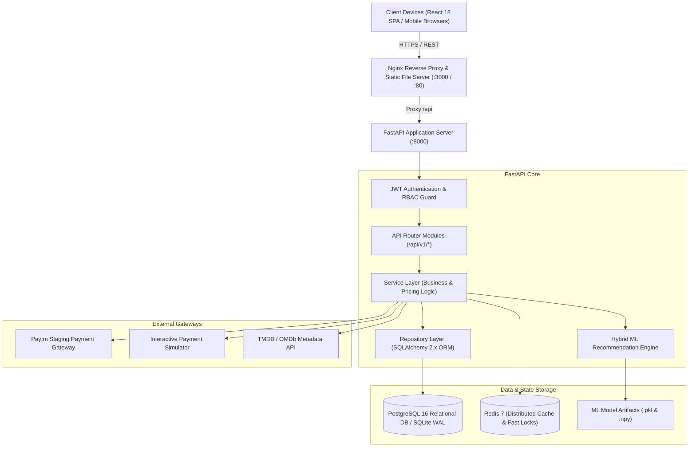
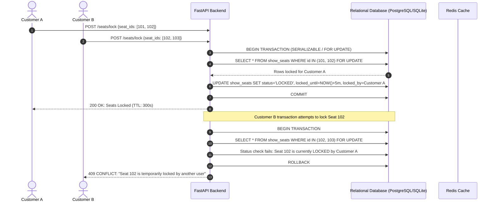

# System Architecture & Technical Design

CineBook AI is an enterprise-grade movie and event reservation platform built following Clean Architecture, Domain-Driven Design (DDD) principles, and Twelve-Factor App methodology.

---

## High-Level System Architecture



---

## Architectural Layers & Separation of Concerns

### 1. Presentation & Routing Layer (`app/routers/`)
- Declarative FastAPI routing with automatic OpenAPI 3.1 documentation generation.
- Enforces HTTP contract validation using strict Pydantic v2 schemas (`app/schemas/`).
- Standardized response envelope across every endpoint:
  ```json
  {
    "success": true,
    "message": "Human readable status message",
    "data": { ... },
    "error_code": null,
    "details": null
  }
  ```

### 2. Business Logic & Service Layer (`app/services/`)
- Isolates domain operations, business validations, and calculations from data access mechanics.
- **Seat Booking & Pricing Engine** (`booking_service.py`):
  - Strictly calculates ticket base prices, tier multipliers, dynamic convenience fee (5%), 18% Integrated GST on convenience fee, and coupon deductions on the backend.
  - Never accepts pricing numbers submitted by client browsers.
- **Seat Locking Manager** (`seat_service.py`):
  - Atomically enforces row-level locking (`with_for_update()`) and handles time-to-live expiration (5-minute TTL).
- **Payment Orchestrator** (`payment_service.py`):
  - Bridges external payment providers (Paytm staging gateway) and internal double-entry ledger state changes.

### 3. Data Access & Repository Layer (`app/repositories/`)
- Wraps SQLAlchemy 2.0 sessions with explicit method contracts.
- Uses `joinedload` and `selectinload` to prevent N+1 query antipatterns across nested relations (e.g. Shows -> Screens -> Theatres -> Cities).
- Isolates complex SQL queries, pagination logic, and database-specific dialect nuances.

### 4. Database Persistence Layer (`app/models/`, `app/database/`)
- Complete declarative model definitions across 24 relational tables.
- Foreign keys with `ON DELETE CASCADE` and targeted index creation for low-latency queries on hot paths (e.g. `(show_id, status)`).
- Dual database compatibility:
  - **Local Development**: SQLite with Write-Ahead Logging (`PRAGMA journal_mode=WAL; PRAGMA busy_timeout=5000;`).
  - **Production / Containerized**: PostgreSQL 16 Alpine.

### 5. Machine Learning Pipeline (`app/ml/`)
- **Content-Based Vectorizer** (`content_based.py`):
  - TF-IDF vectorization across enriched movie metadata (genres, plot synopsis, director, star cast, and keywords).
  - Pre-computed cosine similarity matrix with $O(1)$ lookup latency during runtime inference.
- **Collaborative Filtering** (`collaborative.py`):
  - Item-Item co-occurrence interaction matrix computed from verified user bookings and ratings.
- **Hybrid Inference** (`hybrid.py`):
  - Dynamically blends Content-Based similarity (70% default weight) and Collaborative Filtering (30% weight) with popularity fallback for cold-start users.
  - Generates transparent explainability reasons (e.g., *"Because you watched Sci-Fi: Inception"*).

---

## Concurrency & Transaction Management



1. **Row-Level Locking**: When locking seats, the query executes `SELECT ... FOR UPDATE` ensuring no two transactions can read the seat status concurrently before one acquires an exclusive lock.
2. **Deterministic Sort Order**: Before locking multiple seat IDs, the list is deterministically sorted (`sorted(seat_ids)`) across all requests, preventing circular wait deadlocks between concurrent users selecting overlapping seat batches.
3. **Automatic TTL Expiration**: Each lock sets `locked_until = datetime.now(timezone.utc) + timedelta(minutes=5)`. A scheduled sweep or just-in-time check automatically releases expired seats back to `AVAILABLE` without human intervention.
