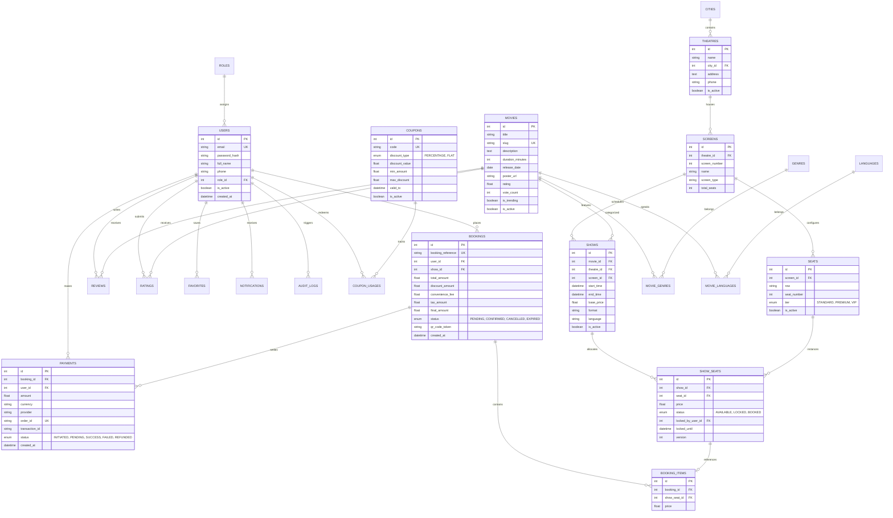

# Database Schema & Entity Relationships

CineBook AI utilizes a 24-table relational database architecture designed for third normal form (3NF) compliance, transactional integrity, and low-latency query performance.

---

## Entity-Relationship Diagram (Mermaid)

---

## Key Table Classifications

### 1. Identity, Access & System
- **`roles`**: System roles (`USER`, `ADMIN`).
- **`users`**: Customer and administrator credentials, profiles, and password hashes.
- **`notifications`**: User alert messages (booking confirmations, payment status updates).
- **`audit_logs`**: Immutable security audit trail tracking critical admin mutations (movie deletion, price adjustments, refund authorisations).

### 2. Cinema Infrastructure & Physical Topology
- **`cities`**: Metro areas and operating territories.
- **`theatres`**: Multiplex facilities with physical address and geospatial coordinates.
- **`screens`**: Auditoriums within a theatre (e.g. IMAX Laser, Dolby Atmos Screen 1).
- **`seats`**: Physical seating grid configuration per screen (`row`, `seat_number`, `tier`).

### 3. Movie Catalog & Metadata
- **`movies`**: Titles, plot, durations, certification, ratings, and media links.
- **`genres`** & **`movie_genres`**: Normalized many-to-many genre taxonomy.
- **`languages`** & **`movie_languages`**: Audio track availability.
- **`reviews`** & **`ratings`**: Verified customer sentiment with aggregate rollups.
- **`favorites`**: Customer watchlists.

### 4. Showtimes & Concurrency Inventory
- **`shows`**: Scheduled exhibition slot linking Movie + Theatre + Screen + Datetime + Base Price.
- **`show_seats`**: Operational runtime inventory state machine for each showtime.
  - States: `AVAILABLE` $\rightarrow$ `LOCKED` $\rightarrow$ `BOOKED`.
  - Holds `locked_until` (TTL expiration) and `locked_by_user_id`.

### 5. Financial Ledger, Bookings & Coupons
- **`bookings`**: Master reservation record with snapshot financial calculations.
- **`booking_items`**: Line items recording historical ticket price at transaction time.
- **`payments`**: Payment transaction lifecycle records (Paytm / Demo simulator).
- **`coupons`** & **`coupon_usages`**: Promotional discount rules and single-use audit logs.

### 6. Machine Learning Telemetry
- **`recommendation_events`**: Feedback loop logging impressions, clicks, and bookings resulting from AI recommendations.

---

## Critical Architectural Design Decisions

1. **Separation of `seats` from `show_seats`**:
   - `seats` represents the immutable physical layout of an auditorium (Screen 1 Row A Seat 1).
   - `show_seats` instantiates that physical seat for a specific scheduled date and time (`show_id`), maintaining independent state flags (`status`, `locked_until`, `price`). This allows a single physical seat to be reserved across hundreds of daily shows without collision.

2. **Price Snapshotting in `booking_items` and `bookings`**:
   - Movie ticket prices change over time (weekend surcharges, prime-time increases). Once a booking is created, the exact purchase price and tax breakdown are permanently snapshotted in `bookings` and `booking_items`, ensuring historical financial audits and invoices are 100% immutable.

3. **Composite Indexes for Hot Search Paths**:
   - `ix_show_seats_show_status`: `(show_id, status)` for ultra-fast auditorium seat availability lookups.
   - `ix_shows_movie_theatre_date`: `(movie_id, theatre_id, start_time)` for low-latency showtime schedule listings.
   - `ix_movies_slug`: Unique slug indexing for SEO-friendly canonical routing.
