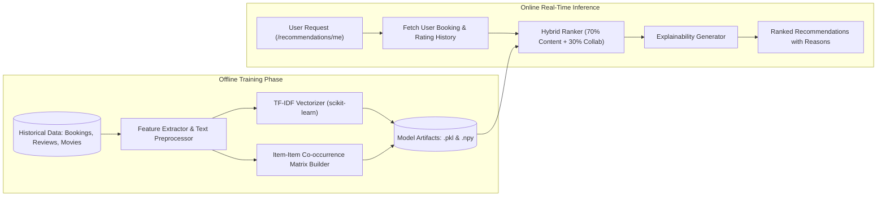

# Machine Learning Recommendation Engine

CineBook AI integrates a hybrid machine learning recommendation engine designed to deliver personalized, low-latency movie recommendations with real-time explainability.

---

## Architecture Overview



---

## 1. Content-Based Filtering (TF-IDF + Cosine Similarity)

### Feature Engineering
For each movie, an enriched metadata "feature soup" is synthesized:
$$\text{Metadata Soup} = \text{Title} + \text{Genres} \times 2 + \text{Director} \times 2 + \text{Cast} + \text{Plot Keywords} + \text{Description}$$
*Note: Genres and Directors are weighted twice to reinforce thematic and stylistic continuity.*

### Mathematical Formulation
The textual feature representations are transformed into dense TF-IDF vectors:
$$\text{TF-IDF}(t, d, D) = \text{TF}(t, d) \times \log\left(\frac{1 + |D|}{1 + |\{d \in D : t \in d\}|}\right) + 1$$

Pairwise similarity between all movies $A$ and $B$ is calculated using the Cosine Similarity metric:
$$\text{Cosine Similarity}(A, B) = \frac{\mathbf{v}_A \cdot \mathbf{v}_B}{\|\mathbf{v}_A\|_2 \|\mathbf{v}_B\|_2}$$

The resulting $N \times N$ similarity matrix is precomputed and saved as `cosine_sim.npy`, ensuring inference queries execute in $O(1)$ matrix indexing time.

---

## 2. Item-Item Collaborative Filtering

Collaborative filtering identifies patterns from verified user interactions:
1. **User Interaction Matrix**: Builds an interaction matrix $R_{u, i}$ from completed bookings and ratings ($1.0 - 5.0$).
2. **Item Co-occurrence**: Computes the co-booking frequency: how often movie $i$ and movie $j$ were booked by the same cohort of users.
3. **Normalized Co-occurrence**:
   $$\text{Sim}_{\text{collab}}(i, j) = \frac{|\text{Users}(i) \cap \text{Users}(j)|}{\sqrt{|\text{Users}(i)| \times |\text{Users}(j)|} + \epsilon}$$

---

## 3. Hybrid Blending & Scoring Formula

For a given user $u$ with interaction history $H_u = \{m_1, m_2, \dots, m_k\}$, the hybrid score for candidate movie $m$ is:
$$\text{Score}(u, m) = w_{\text{content}} \cdot \max_{h \in H_u} \text{Sim}_{\text{content}}(h, m) + w_{\text{collab}} \cdot \sum_{h \in H_u} \frac{\text{Sim}_{\text{collab}}(h, m)}{|H_u|}$$

- Default weights: $w_{\text{content}} = 0.7$, $w_{\text{collab}} = 0.3$.
- Configurable via environment variables `ML_HYBRID_CONTENT_WEIGHT` and `ML_HYBRID_COLLAB_WEIGHT`.

---

## 4. Cold-Start Mitigation & Popularity Fallback

When a new user with zero prior bookings accesses the platform (the classic Cold-Start problem), the recommender employs a weighted popularity score:
$$\text{Popularity Score}(m) = \text{Rating}(m) \times \log(1 + \text{Vote Count}(m)) \times \text{Trending Multiplier}$$
This ensures high-quality, popular cinematic releases are surfaced immediately until interaction telemetry is acquired.

---

## 5. Model Explainability Generator

A critical requirement in enterprise AI is explainability. CineBook AI automatically generates contextual reasons for every recommendation:
- **Content match**: *"Because you watched Sci-Fi: Interstellar"*
- **Director match**: *"Directed by Christopher Nolan, whom you enjoyed in Oppenheimer"*
- **Collaborative match**: *"84% of viewers who booked Fighter also watched this"*
- **Popularity fallback**: *"Top rated in Action & Thriller across your city"*

---

## 6. Offline Training & Evaluation CLI

The machine learning models can be retrained on new catalogue data or interaction events using the automated training module:

```bash
# Navigate to backend directory
cd backend

# Execute offline training pipeline
python -m app.ml.train
```

### Artifact Outputs (`backend/app/ml/artifacts/`):
- `tfidf_vectorizer.pkl`: Fitted scikit-learn TF-IDF vectorizer.
- `cosine_sim.npy`: Precomputed pairwise similarity array.
- `collab_model.pkl`: Serialized item-item interaction matrix.
- `metadata.json`: Model version, training timestamps, and vocabulary size.
