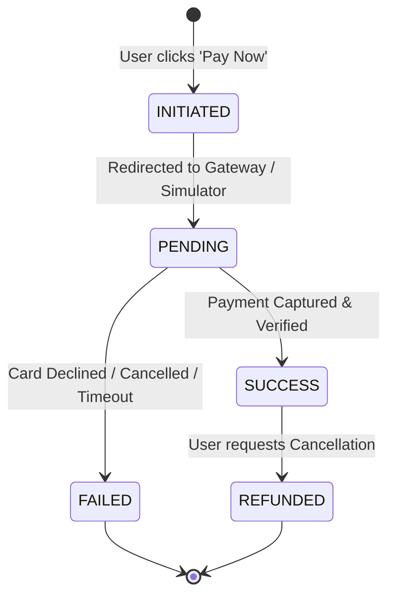

# Payment Flow & Financial Ledger Design

CineBook AI implements an enterprise double-entry financial calculation engine and multi-provider payment architecture. The platform guarantees that no client-submitted pricing numbers are ever trusted, and all transactions adhere strictly to ACID guarantees.

---

## Strict Backend Pricing Calculation Rules

All pricing computations occur exclusively on the backend (`backend/app/services/booking_service.py`):

1. **Seat Base Calculation**:
   $$\text{Seat Price} = \text{Show Base Price} \times \text{Tier Multiplier}$$
   - **STANDARD**: $1.0\times$
   - **PREMIUM**: $1.3\times$
   - **VIP**: $1.8\times$
   $$\text{Base Subtotal} = \sum \text{Seat Prices}$$

2. **Promotional Coupon Discount**:
   - Flat discount: $\min(\text{Discount Value}, \text{Base Subtotal})$
   - Percentage discount: $\min\left(\text{Base Subtotal} \times \frac{\text{Discount \%}}{100}, \text{Max Discount Limit}\right)$
   $$\text{Discounted Subtotal} = \text{Base Subtotal} - \text{Discount Amount}$$

3. **Convenience Fee (Platform Surcharge)**:
   $$\text{Convenience Fee} = \text{Discounted Subtotal} \times 0.05 \quad (5\%)$$

4. **Tax Calculation (Integrated GST)**:
   Per Indian financial compliance laws, GST is levied only on the convenience service fee:
   $$\text{GST Tax} = \text{Convenience Fee} \times 0.18 \quad (18\%)$$

5. **Final Payable Amount**:
   $$\text{Final Amount} = \text{Discounted Subtotal} + \text{Convenience Fee} + \text{GST Tax}$$

---

## Payment Lifecycle State Machine

### State Transitions and Invariants
- **`INITIATED`**: A unique `order_id` (e.g., `CB-ORD-8F3A2...`) is generated and associated with the `booking_id`.
- **`PENDING`**: The transaction is handed over to the external processor (Paytm Gateway or Demo Simulator).
- **`SUCCESS`**:
  - The payment transaction status flips to `SUCCESS`.
  - The booking status transitions from `PENDING` to `CONFIRMED`.
  - The reserved `show_seats` transition permanently from `LOCKED` to `BOOKED`.
  - An entry boarding pass token and Base64 QR code are generated.
  - Confirmation notifications are dispatched.
- **`FAILED`**:
  - Payment records capture failure reason code.
  - The booking status flips to `CANCELLED` or returns to checkout.
  - Locked seats remain locked until their 5-minute TTL expires, or are released immediately for retry.
- **`REFUNDED`**:
  - Triggered upon customer cancellation.
  - Marks payment as `REFUNDED` and frees `show_seats` back to `AVAILABLE`.

---

## Dual Gateway Integration

### 1. Paytm Staging Gateway (`app/services/payment_service.py`)
- Communicates with Paytm staging endpoints:
  `https://securegw-stage.paytm.in/order/process`
- Implements checksum hashing using SHA-256 for cryptographic request/response verification.
- Handles asynchronous webhook callbacks (`POST /api/v1/payments/paytm/callback`).

### 2. Interactive Demo Payment Simulator
- In technical interviews or client evaluations without live credit card terminals, the platform provides a built-in **Payment Simulator**:
- Accessible directly via the UI modal or API endpoint:
  `POST /api/v1/payments/simulate`
- Supported scenarios:
  1. **`SUCCESS`**: Instantly settles payment, confirms reservation, generates QR boarding pass.
  2. **`FAILURE`**: Simulates bank card decline, tests application recovery and error banner.
  3. **`PENDING`**: Simulates webhook polling and asynchronous reconciliation.

---

## Idempotency & Double-Booking Prevention

1. **Order ID Uniqueness**: Every payment attempt generates a cryptographically unique `order_id` with a database uniqueness constraint preventing duplicate charge attempts for the same reservation.
2. **Atomic Confirmation Check**:
   Before marking a payment `SUCCESS`, the service verifies within a single database transaction:
   - Does the booking exist and is it in `PENDING` status?
   - Are all selected `show_seats` currently `LOCKED` by this specific user?
   - Has the lock TTL not expired?
   If any condition fails, the transaction immediately rolls back and refunds any captured funds.
